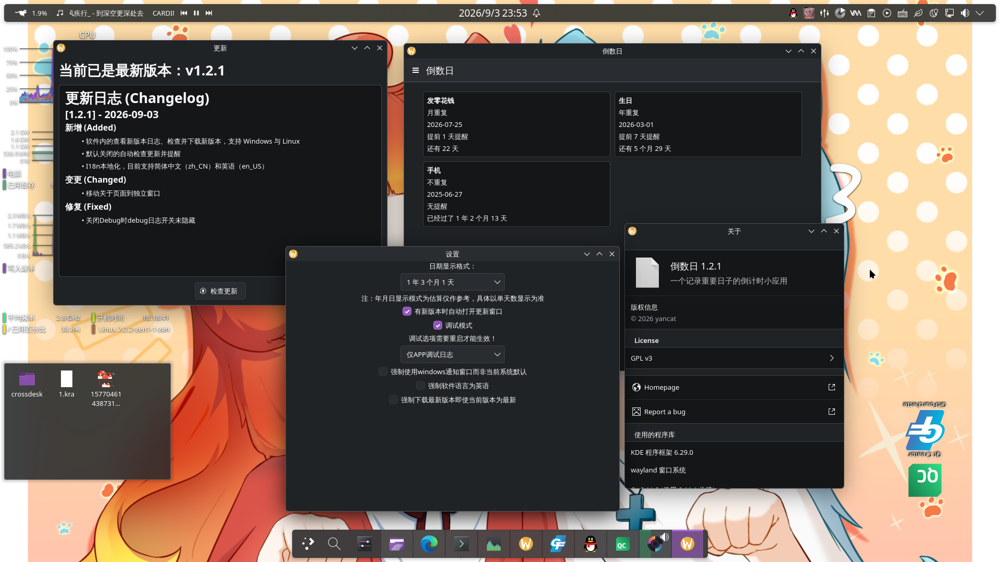
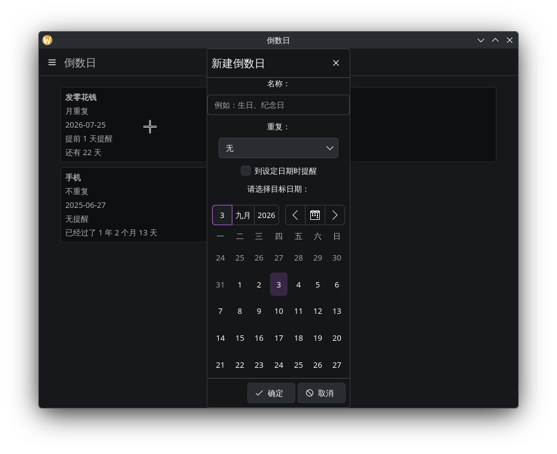
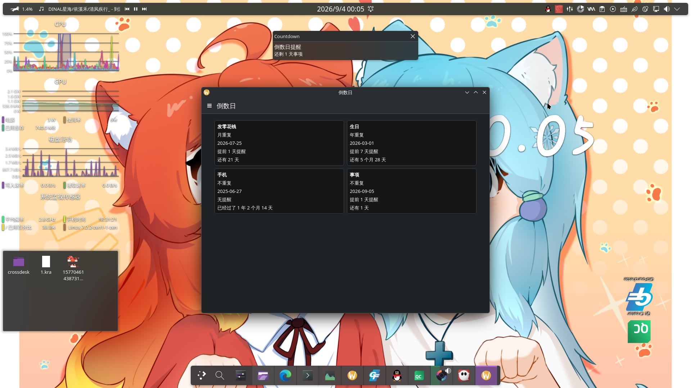

# 倒数日

[English](README_en.md) | 中文

## 简介

一个基于 Kirigami / Qt 6 的倒数日桌面应用，用来记录和追踪生日、纪念日、截止日期等重要日子。

界面使用 KDE Frameworks 6 的 Kirigami 组件与 QML 构建，简洁现代，支持 Linux 与 Windows；Android 目前为实验性支持。

主要功能：

- 新建、编辑、删除倒计时事项，直观显示距目标日期的剩余天数（或已过天数）
- 支持无重复、月重复、年重复三种倒计时模式
- 在设定日期提醒，可选当天、前一天或自定义天数提醒
- 软件内检查更新（自动检查默认关闭）
- 支持中英文界面（i18n）
- 支持静默（最小化）启动参数与 Debug 日志开关

数据以 JSON 保存于本地，设置项存储在 `~/.config/yancat/Countdown.conf`。

## 画廊

<p align="center">
  <table>
    <tr>
      <td></td>
      <td></td>
      <td></td>
    </tr>
  </table>
</p>

## 安装帮助

Release 中提供 Linux 二进制、 Windows 安装包与 Android APK。
Android 当前为 **测试版本**，可能存在不稳定情况。

> 本程序需要 Qt6/KF6/Kirigami/QML 运行时\
> 如果你已安装完整的 KDE Plasma 6 桌面环境（Arch：plasma-meta；Debian/Ubuntu：kde-plasma-desktop 且未禁用推荐依赖），这些依赖通常已随桌面安装，无需手动补装。

通常需要这些包以供运行：

Arch Linux:
```bash
sudo pacman -S qt6-base qt6-declarative kirigami kcoreaddons kiconthemes breeze qqc2-desktop-style qt6-wayland
```

Ubuntu / Debian:
```bash
sudo apt install libqt6core6t64 libqt6qml6 libqt6quick6 \
  libkf6coreaddons6 libkf6iconthemes6 libkirigami6 \
  breeze qml6-module-qtquick-controls qml6-module-qt-labs-platform \
  qml6-module-qtquick-layouts qt6-wayland
```
> Ubuntu 最低支持 24.10；建议使用 26.04 LTS 或仍受支持的版本。Debian 请按实际仓库调整包名。

## 构建帮助

### CMake

> 请安装 [安装帮助](#安装帮助) 内的包与对应的开发包。

```bash
git clone https://github.com/yan-cat/countdown.git
cd countdown
cmake -B build -DCMAKE_BUILD_TYPE=Release
cmake --build build -j$(nproc)
```

可执行文件位于 `build/Countdown`。

### KDE Craft

```bash
# 拷贝蓝图至蓝图目录
craft Countdown
craft --package Countdown # Android 无需此步骤
```

## 技术细节

项目目录：

> 未展开部分为无需注释的文件夹。

```plaintext
Countdown
├── android                           # Android 实验性支持
├── readme_img
├── src
│   ├── include                       # 头文件
│   ├── resources
│   │   ├── icon                      # 图标
│   │   └── qml
│   │       ├── AboutPageWindow.qml   # 关于窗口
│   │       ├── DetailsWindow.qml     # 详情窗口
│   │       ├── LogsWindow.qml        # 日志窗口
│   │       ├── Main.qml              # 主页
│   │       ├── ReminderWindow.qml    # Windows 平台独立提醒弹窗
│   │       ├── SettingsWindow.qml    # 设置窗口
│   │       └── UpdaterWindow.qml     # 更新窗口
│   ├── autostart.cpp                 # 开机自启处理
│   ├── countdowndata.cpp             # 处理需要显示的数据
│   ├── datediff.cpp                  # 从天计算年月日
│   ├── debug.cpp                     # Debug 相关
│   ├── main.cpp                      # 主程序
│   ├── manager.cpp                   # 管理数据
│   ├── reminder.cpp                  # 倒数日提醒
│   └── updater.cpp                   # 检查并更新程序
├── translations                      # I18n
├── CHANGELOG.md                      # 更新日志
├── CMakeLists.txt
├── com.countdown.desktop             # Linux Desktop 文件
├── Countdown.nsi                     # 安装器脚本
├── Countdown.py                      # KDE Craft 蓝图
├── exclude_list.txt                  # 打包文件黑名单
├── LICENSE
├── README_en.md
└── README.md
```

软件创建的文件（夹）：

```plaintext
~
├── .local
│   └── share
│       └── yancat
│           └── Countdown
│               ├── countdowns.json   # 倒数日数据
│               └── logs
│                   └── Countdown.log # 软件日志（开启日志写文件时）
└── .config
    └── yancat
        └── Countdown.conf            # 设置项
```

## 更新日志

各版本的详细变更见 [CHANGELOG.md](CHANGELOG.md)。

## 待完成

- [ ] 开机自启选模式，开窗口或者托盘
- [ ] 卡片排序 
- [ ] Android 检查更新
- [ ] WebDAV 云同步事项
- [ ] 桌面磁贴
- [ ] 可选软件背景

开发过程由 AI 辅助。
