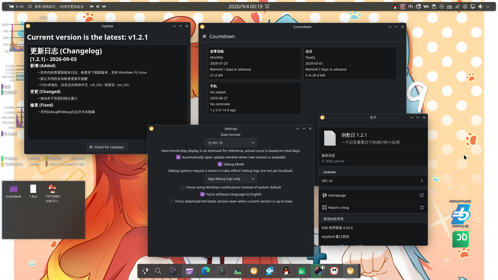
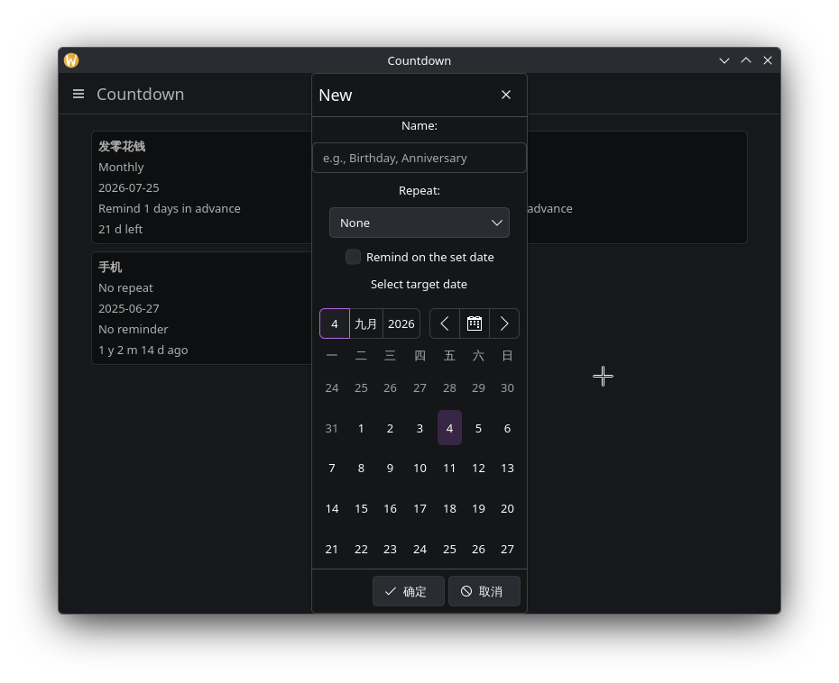
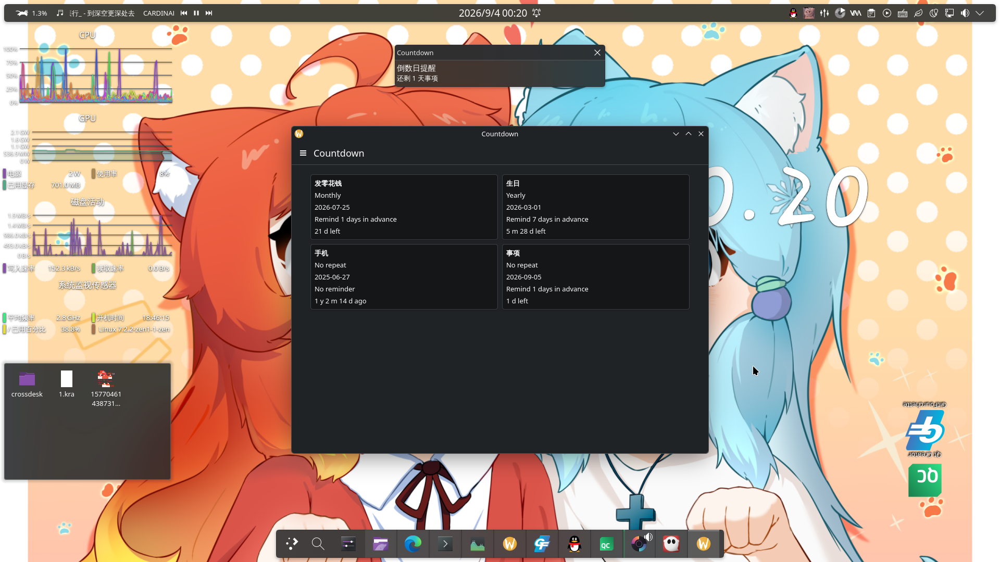

# Countdown
English | [中文](README.md)
## Introduction

A countdown desktop application built with Kirigami / Qt 6, used to record and track important days such as birthdays, anniversaries, and deadlines.

The UI is built with KDE Frameworks 6 Kirigami components and QML. It's simple and modern, supports Linux and Windows, and has Android support reserved.

Main features:

- Create, edit, and delete countdown items, intuitively showing the days remaining until the target date (or the days that have passed)
- Three countdown modes: no repeat, monthly repeat, yearly repeat
- Remind on the set date, optionally on the day itself, one day before, or a custom number of days before
- In-app update check (automatic check is off by default)
- Supports Chinese and English UI (i18n)
- Silent (minimized) launch parameter and a Debug log switch

Data is saved locally as JSON; settings are stored in `~/.config/yancat/Countdown.conf`.

## Gallery

<p align="center">
  <table>
    <tr>
      <td></td>
      <td></td>
      <td></td>
    </tr>
  </table>
</p>

## Installation

Linux binaries are provided in the Releases.

The following packages are usually required at runtime:

ArchLinux:
```bash
sudo pacman -S qt6-base qt6-declarative kirigami kcoreaddons kiconthemes breeze qqc2-desktop-style qt6-wayland
```

Ubuntu / Debian:
```bash
sudo apt install libqt6core6t64 libqt6qml6 libqt6quick6 \
  libkf6coreaddons6 libkf6iconthemes6 libkf6kirigami6 \
  breeze qml6-module-qtquick-controls qml6-module-qt-labs-platform \
  qml6-module-qtquick-layouts qt6-wayland
```
Only **Ubuntu 24.10 (Oracular) or newer** is supported.

## Technical Details

Project structure:

```plaintext
countdown
├── android                           # Not used yet
│   ├── AndroidManifest.xml
│   └── splash.xml
├── CMakeLists.txt
├── Countdown.py                      # KDE Craft blueprint
├── LICENSE
├── README.md
├── src
│   ├── countdowndata.cpp             # Handles the data to be displayed
│   ├── datediff.cpp                  # Computes years/months/days from days
│   ├── debug.cpp                     # Debug related
│   ├── main.cpp                      # Main program
│   ├── manager.cpp                   # Manages data
│   ├── reminder.cpp                  # Countdown reminders
│   └── updater.cpp                   # Checks and applies updates
│   ├── include                       # Header files
│   ├── resources
│   │   └── qml
│   │       ├── AboutPageWindow.qml   # About page
│   │       ├── Main.qml              # Main page
│   │       ├── ReminderWindow.qml    # Standalone reminder popup for Windows
│   │       ├── SettingsWindow.qml    # Settings page
│   │       └── UpdaterWindow.qml     # Update page
└── translations                      # I18n
    ├── countdown_en.ts
    ├── countdown_en_US.ts
    └── countdown_zh_CN.ts
```

Files (and folders) created by the application:

```plaintext
~
├── .local
│   └── share
│       └── yancat
│           └── Countdown
│               └── countdowns.json # Countdown data
└── .config
    └── yancat
        └── Countdown.conf          # Settings
```

## Planned

- [ ] Optional app background
- [ ] Android support
- [ ] WebDAV cloud sync of items
- [ ] Desktop tiles/widget
- [ ] Fix dark display issues on Windows

## Done

- [x] In-app update check with automatic checking off by default
- [x] I18n
- [x] Windows reminders when time is up / days remaining
- [x] Data migration from old versions to the new format
- [x] Debug switch
- [x] Linux reminders when time is up / days remaining
- [x] Silent launch parameter
- [x] Edit existing items

This program was developed with AI assistance.

> **Note:** This English README may not be the latest version. Please refer to the [Chinese README](README.md) (or the source code) for the most up-to-date information.
